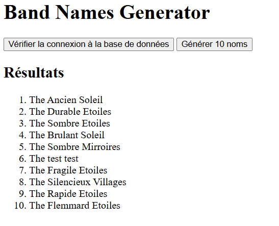
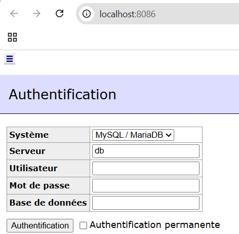

# Band Names Generator (Projet Docker Compose)

## Table des matières
- [Présentation](#présentation)
- [Lancer le projet](#lancer-le-projet)
  - [Prérequis](#prérequis)
  - [Installation et lancement](#installation-et-lancement)
- [Gestion des environnements](#gestion-des-environnements)
- [Liens utiles](#liens-utiles)
- [Remarques](#remarques)
- [Sources du projet](#sources-du-projet)

---


## Présentation
Ce projet permet de générer **aléatoirement des noms de groupes de musique en anglais** suivant le schéma : "The {adjectif} {nom}

Le projet est **entièrement conteneurisé avec Docker** et comporte trois services :

1. **web** : application Flask affichant la page HTML et gérant la logique métier.


2. **db** : base de données MySQL contenant les adjectifs et noms.
3. **admin** : interface Adminer pour gérer la base de données.



## Prérequis
- Docker & Docker Compose (v2.x recommandé)
- (optionnel) accès réseau sur les ports 8085 (web) et 8086 (adminer)


## Installation / lancement (environnement développement)
1. Cloner ou récupérer le projet et placer-vous dans le dossier racine contenant `docker-compose.yaml`.

2. Copier le fichier d’environnement :
```cmd
copy .env.dist .env
```

3. Lancer le projet avec docker Compose

```
docker compose up --build
```

4. Une fois les conteneurs démarrés, accéder à :

* Application Web (Flask) : http://localhost:8085

* Adminer (gestion base MySQL) : http://localhost:8086

    * Serveur : db

    * Base : bandnames

    * User/Pass : comme indiqué dans .env (banduser / bandpass par défaut)

5. Pour arrêter le projet : 
```
docker compose down
```

6. Pour rebuild proprement après la modification :
```
docker compose build --no-cache
docker compose up
```
## Gestion des environement
Lors du passage développement → production, plusieurs éléments peuvent changer :

* Données : la base peut contenir des données réelles ou supplémentaires.

* Configuration : .env peut changer (utilisateurs, mots de passe, noms de DB, ports).

* Ports exposés : en production, on pourrait changer les ports (ex : 80 ou 443).

* Images Docker : on utilisera l’image nommée bandnamesgenerator:1.0.0 pour la prod.

* Volumes : les volumes de développement peuvent être remplacés par des volumes persistants en prod.

## Liens utiles

[Docker Desktop](https://www.docker.com/products/docker-desktop/)

[Docker Compose documentation](https://docs.docker.com/compose/)

[Flask Documentation](https://flask.palletsprojects.com/)

[MySQL Documentation](https://dev.mysql.com/doc/)

[Adminer](https://www.adminer.org/)

## Remarque
* Ce projet à été développer en utilisant Visual Studio code, ainsi que l'invite de commande windows
* difficulté rencontrées :
Docker n'est pas mon outils de prédisposition, j'ai donc rencontré des problème avec :
    * Installation de mysql-connector-python sur Docker Desktop Windows → remplacé par mysql-connector pour éviter les erreurs de compilation.
    * Gestion des chemins relatifs et de la syntaxe EOF pour CMD.

## Sources du projet
* **Dockerfile du service web** : web/Dockerfile

* **Fichier Compose** : docker-compose.yaml

* **Sources de l’application** : web/app.py, web/templates/index.html

* **Fichier requirements** : web/requirements.txt

* **Fichier SQL initial** : db/init.sql

* **Fichier environnement** : .env.dist

* **.dockerignore** : web/.dockerignore

* **README.md** : ce fichier